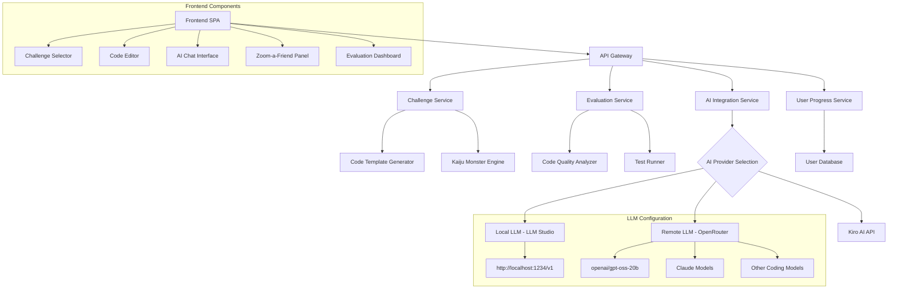

# Design Document

## Overview

Kiro Kaiji: Refactor Rampage is a single-page web application (SPA) built with modern web technologies to provide an engaging, gamified coding education experience. The application uses a component-based architecture with responsive design principles to ensure seamless functionality across desktop and mobile devices. The core gameplay loop involves challenge generation, code editing, AI assistance, peer consultation, and automated evaluation.

## Architecture

### High-Level Architecture



### Technology Stack

- **Frontend**: Vue 3 with TypeScript for component-based UI
- **Styling**: Tailwind CSS for responsive design and theming
- **Code Editor**: Monaco Editor (VS Code editor) with syntax highlighting
- **State Management**: Pinia for Vue state management
- **API Communication**: Axios for HTTP requests
- **Build Tool**: Vite for fast development and optimized builds
- **Testing**: Vitest and Vue Testing Library
- **Deployment**: Local development with Kiro integration OR AWS services with OpenRouter API for AI

### Deployment Modes

#### Local Mode (Kiro IDE Integration)
- **File Management**: Kiro IDE handles file modifications directly in the local workspace
- **Code Submission**: Users submit code through the locally running application
- **AI Integration**: Direct integration with Kiro's built-in AI capabilities
- **Benefits**: No external dependencies, immediate feedback, full IDE integration

#### AWS Cloud Mode with Flexible AI Provider Options
- **Infrastructure**: AWS Lambda functions for serverless backend services
- **Storage**: AWS DynamoDB for user progress and challenge data
- **AI Provider Options**:
  - **Local LLM**: OpenAI-compatible endpoint (default: http://localhost:1234/v1) using LLM Studio or similar
  - **Remote LLM**: OpenRouter API with preferred models (openai/gpt-oss-20b, Claude, other coding-focused models)
- **Benefits**: Scalable, multi-user support, persistent data storage, flexible AI provider options

### AI Provider Selection Strategy

#### Local LLM Configuration (Requirement 9.1, 9.5)
```typescript
interface LocalLLMConfig {
  defaultEndpoint: 'http://localhost:1234/v1';
  connectionTimeout: number;
  retryAttempts: number;
  fallbackBehavior: 'error-message' | 'switch-to-remote' | 'offline-mode';
  healthCheck: {
    endpoint: '/v1/models';
    interval: number;
    failureThreshold: number;
  };
}
```

#### Remote LLM Configuration (Requirement 9.2, 9.4, 9.6)
```typescript
interface RemoteLLMConfig {
  provider: 'openrouter';
  preferredModels: ['openai/gpt-oss-20b', 'claude-3-haiku', 'coding-focused-models'];
  fallbackStrategy: {
    automaticFallback: boolean;
    fallbackOrder: string[];
    costOptimization: 'free-tier-priority' | 'performance-priority';
  };
  rateLimiting: {
    requestDelay: number; // Small delay to avoid quotas (Requirement 9.3)
    quotaManagement: boolean;
    costTracking: boolean;
  };
}
```

#### AI Provider Abstraction Layer
The system implements a unified interface that abstracts the differences between AI providers:

```typescript
interface AIProviderInterface {
  provider: 'kiro' | 'local' | 'remote';
  isAvailable: () => Promise<boolean>;
  sendRequest: (prompt: string, options: RequestOptions) => Promise<string>;
  getAvailableModels: () => Promise<string[]>;
  handleError: (error: AIProviderError) => AIProviderResponse;
}

interface AIProviderError {
  type: 'connection-failed' | 'model-unavailable' | 'quota-exceeded' | 'invalid-response';
  provider: string;
  originalError: Error;
  fallbackOptions: string[];
}
```

## Components and Interfaces

### Core Components

#### 1. Challenge Selector Component
```typescript
interface ChallengeConfig {
  language: ProgrammingLanguage;
  framework?: Framework;
  category: ChallengeCategory;
  difficulty: DifficultyLevel;
}

interface ChallengeSelector {
  onConfigChange: (config: ChallengeConfig) => void;
  onGenerateChallenge: () => void;
  isLoading: boolean;
  activeChallenges: Challenge[]; // Support multiple active challenges
}

interface ChallengeTransition {
  smoothTransition: boolean; // Ensure smooth transition to challenge
  autoOpen: boolean; // Automatically open challenge after generation
}
```

#### 2. Kaiju Monster Engine
```typescript
interface KaijuMonster {
  id: string;
  name: string;
  description: string;
  avatar: string;
  codePatterns: CodeAntiPattern[];
  difficultyModifiers: DifficultyModifier[];
}

enum KaijuType {
  HYDRA_BUG = 'hydra-bug',
  COMPLEXASAUR = 'complexasaur',
  DUPLICATRON = 'duplicatron',
  SPAGHETTIZILLA = 'spaghettizilla',
  MEMORYLEAK_ODACTYL = 'memoryleak-odactyl'
}
```

#### 3. Code Editor Interface
```typescript
interface CodeEditorProps {
  initialCode: string;
  language: string;
  onChange: (code: string) => void;
  readOnly?: boolean;
  theme: 'light' | 'dark';
}
```

#### 4. AI Chat Interface
```typescript
interface AIChatMessage {
  id: string;
  role: 'user' | 'assistant';
  content: string;
  timestamp: Date;
  context?: ChallengeContext;
}

interface AIChatInterface {
  messages: AIChatMessage[];
  onSendMessage: (message: string) => void;
  isLoading: boolean;
  challengeContext: ChallengeContext;
  autoScrollBehavior: 'smooth' | 'instant'; // Auto-scroll to bottom at reading speed
  scrollSpeed: number; // Average reading speed for smooth scrolling
}

interface AIServiceConfig {
  provider: 'kiro' | 'local' | 'remote';
  localEndpoint?: string; // Default: http://localhost:1234/v1
  remoteApiKey?: string;
  remoteModel?: string; // Preferred: openai/gpt-oss-20b, Claude
  requestDelay: number; // Small delay to avoid quota issues
  maxTokens: number;
  temperature: number;
  fallbackModels: string[]; // Automatic fallback to other coding-focused models
  errorHandling: {
    localEndpointUnreachable: boolean;
    remoteModelUnavailable: boolean;
    quotaExceeded: boolean;
  };
}

interface AICapabilities {
  refactoringAssistance: boolean; // Provide specific code structure improvements
  testGeneration: boolean; // Generate appropriate unit test cases
  requirementImplementation: boolean; // Guide through implementation process
  contextMaintenance: boolean; // Maintain challenge and code state context
}
```

#### 5. Zoom-a-Friend Panel
```typescript
interface TeamMember {
  id: string;
  role: TeamRole;
  avatar: AnimalAvatar;
  name: string;
  specialties: string[];
  dialogStyle: DialogStyle; // Animal-themed communication patterns
}

enum TeamRole {
  QA = 'quality-assurance', // Pufferfish - defects and bugs focus
  ARCHITECT = 'architect', // Owl - architectural advice with "Architecture" and "Redundancy"
  PRODUCT_OWNER = 'product-owner', // Pig - requirements clarification
  SENIOR_DEVELOPER = 'senior-developer' // Cat - coding best practices
}

enum AnimalAvatar {
  PUFFERFISH = 'pufferfish', // Quality Assurance role
  OWL = 'owl', // Architect role
  PIG = 'pig', // Product Owner role
  CAT = 'cat' // Senior Developer role
}

interface DialogStyle {
  animalSounds: string[]; // Primary communication through animal sounds
  keyTerms: string[]; // Technical terms interspersed in dialog
  communicationPattern: 'mostly-sounds' | 'balanced' | 'technical-heavy';
}

interface ZoomAFriendInteraction {
  displaySelection: boolean; // Show animal icons with role titles
  roleSpecificAdvice: {
    qa: 'defects-and-bugs-focused';
    architect: 'architectural-with-owl-themes';
    productOwner: 'requirements-clarification';
    seniorDeveloper: 'coding-best-practices';
  };
  codeCommentGeneration: boolean; // Add AI-generated comments to existing code
}
```

#### 6. AI Grading Service
```typescript
interface AIGradingService {
  submitForGrading: (challengeId: string, code: string) => Promise<AIGradingResponse>;
  getAvailableModels: () => Promise<string[]>;
  selectSingleModel: (availableModels: string[]) => string;
  evaluateAllRoles: (code: string, model: string, requirements: string[]) => Promise<AIGradingResponse>;
  parseRoleEvaluations: (response: string) => Record<GradingRole, [number, string]>;
  calculateAverageScore: (roleScores: Record<GradingRole, [number, string]>) => number;
  recordGradingHistory: (userId: string, gradingResult: AIGradingResponse) => Promise<void>;
}

interface GradingPrompts {
  [GradingRole.DEVELOPER]: {
    systemPrompt: string;
    focusAreas: ['code quality', 'best practices', 'maintainability', 'technical implementation'];
    evaluationCriteria: ['clean code principles', 'SOLID principles', 'error handling', 'performance'];
  };
  [GradingRole.ARCHITECT]: {
    systemPrompt: string;
    focusAreas: ['system design', 'scalability', 'patterns', 'architectural decisions'];
    evaluationCriteria: ['design patterns', 'separation of concerns', 'modularity', 'extensibility'];
  };
  [GradingRole.SQA]: {
    systemPrompt: string;
    focusAreas: ['defects', 'edge cases', 'testing coverage', 'quality assurance'];
    evaluationCriteria: ['bug detection', 'test completeness', 'edge case handling', 'validation'];
  };
  [GradingRole.PRODUCT_OWNER]: {
    systemPrompt: string;
    focusAreas: ['requirement fulfillment', 'user experience', 'business value'];
    evaluationCriteria: ['requirement compliance', 'usability', 'feature completeness', 'user value'];
  };
}

interface UnifiedGradingPrompt {
  systemPrompt: string;
  roleInstructions: {
    developer: string;
    architect: string;
    sqa: string;
    productOwner: string;
  };
  responseFormat: string; // JSON format specification
  fallbackModel: string; // Default model if none available
}
```

### API Interfaces

#### Challenge Generation API
```typescript
interface ChallengeRequest {
  language: string;
  framework?: string;
  category: string;
  difficulty: number;
  userId?: string;
}

interface ChallengeResponse {
  id: string;
  kaiju: KaijuMonster;
  initialCode: string;
  requirements: string[];
  testCases: TestCase[];
  hints: string[];
}
```

#### Evaluation API
```typescript
interface EvaluationRequest {
  challengeId: string;
  submittedCode: string;
  userId?: string;
}

interface EvaluationResponse {
  scores: {
    readability: number;
    quality: number;
    defects: number;
    requirements: number;
    overall: number;
  };
  feedback: EvaluationFeedback[];
  achievements?: Achievement[];
}
```

#### AI Grading API
```typescript
interface AIGradingRequest {
  challengeId: string;
  submittedCode: string;
  requirements: string[];
  userId?: string;
}

interface RoleEvaluation {
  role: GradingRole;
  score: number;
  feedback: string;
}

interface AIGradingResponse {
  challengeId: string;
  modelUsed: string;
  roleEvaluations: Record<GradingRole, RoleEvaluation>;
  averageScore: number;
  rawResponse: Record<GradingRole, [number, string]>; // Format: {"developer": [score, "reason"], ...}
  gradingTimestamp: Date;
}

enum GradingRole {
  DEVELOPER = 'developer',
  ARCHITECT = 'architect',
  SQA = 'sqa',
  PRODUCT_OWNER = 'product-owner'
}

interface UnifiedGradingRequest {
  code: string;
  requirements: string[];
  model: string;
  unifiedPrompt: string; // Single prompt requesting all four role evaluations
  expectedFormat: string; // JSON format: {"developer": [score, "reason"], ...}
}
```

## AI-Based Multi-Role Grading System

### Design Rationale
The AI-based grading system addresses Requirement 8 by providing comprehensive feedback from multiple professional perspectives. The design uses a single AI model approach to ensure consistency and reduce API costs while still providing diverse role-based evaluations.

### Unified Grading Architecture
```typescript
interface UnifiedGradingSystem {
  modelSelection: {
    queryAvailableModels: () => Promise<string[]>; // Query /v1/models endpoint
    selectOptimalModel: (available: string[]) => string; // Choose best available model
    fallbackStrategy: string[]; // Ordered list of fallback models
  };
  
  singleRequestEvaluation: {
    unifiedPrompt: string; // Single prompt requesting all four role evaluations
    expectedResponseFormat: 'json'; // {"developer": [score, "reason"], ...}
    roleInstructions: Record<GradingRole, RoleInstruction>;
  };
  
  responseProcessing: {
    parseJSON: (response: string) => Record<GradingRole, [number, string]>;
    calculateAverage: (roleScores: Record<GradingRole, [number, string]>) => number;
    generateFeedback: (roleEvaluations: Record<GradingRole, RoleEvaluation>) => string;
  };
}

interface RoleInstruction {
  systemPrompt: string;
  focusAreas: string[];
  evaluationCriteria: string[];
  scoringGuidelines: string;
}

interface GradingWorkflow {
  step1: 'submit-code-for-grading-button';
  step2: 'query-available-models';
  step3: 'select-single-optimal-model';
  step4: 'send-unified-prompt-to-model';
  step5: 'parse-json-response-with-all-roles';
  step6: 'display-individual-and-average-scores';
  step7: 'record-scores-in-progress-tracking';
}
```

### Role-Specific Evaluation Criteria

#### Developer Role Evaluation
- **Focus Areas**: Code quality, best practices, maintainability, technical implementation
- **Evaluation Criteria**: Clean code principles, SOLID principles, error handling, performance
- **Scoring Weight**: Equal weight with other roles in average calculation

#### Architect Role Evaluation  
- **Focus Areas**: System design, scalability, patterns, architectural decisions
- **Evaluation Criteria**: Design patterns, separation of concerns, modularity, extensibility
- **Scoring Weight**: Equal weight with other roles in average calculation

#### SQA Role Evaluation
- **Focus Areas**: Defects, edge cases, testing coverage, quality assurance concerns
- **Evaluation Criteria**: Bug detection, test completeness, edge case handling, validation
- **Scoring Weight**: Equal weight with other roles in average calculation

#### Product Owner Role Evaluation
- **Focus Areas**: Requirement fulfillment, user experience, business value delivery
- **Evaluation Criteria**: Requirement compliance, usability, feature completeness, user value
- **Scoring Weight**: Equal weight with other roles in average calculation

### Progress Tracking Integration
The grading system integrates with the user progress tracking to provide:
- Historical trend analysis across all role perspectives
- Individual role improvement tracking over time
- Average score progression for overall skill development
- Challenge-specific performance patterns by Kaiju type

## Data Models

### Challenge Model
```typescript
interface Challenge {
  id: string;
  kaiju: KaijuMonster;
  config: ChallengeConfig;
  initialCode: string;
  requirements: Requirement[];
  testCases: TestCase[];
  createdAt: Date;
  timeLimit?: number;
}

interface Requirement {
  id: string;
  description: string;
  priority: 'must' | 'should' | 'could';
  testable: boolean;
}
```

### User Progress Model
```typescript
interface UserProgress {
  userId: string;
  completedChallenges: string[];
  achievements: Achievement[];
  stats: {
    totalChallenges: number;
    averageScore: number;
    kaijuDefeated: Record<KaijuType, number>;
    improvementTrend: number[];
  };
  unlockedDifficulties: DifficultyLevel[];
  gradingHistory: GradingHistoryEntry[]; // Track AI grading results over time
  createdAt: Date;
  updatedAt: Date;
}

interface GradingHistoryEntry {
  challengeId: string;
  gradingTimestamp: Date;
  roleScores: Record<GradingRole, number>; // Individual scores from each role perspective
  averageScore: number; // Calculated average of all role scores
  modelUsed: string; // Single AI model used for unified evaluation
  challengeType: string;
  kaijuType: KaijuType;
  rawResponse: Record<GradingRole, [number, string]>; // Original AI response format
}
```

### Zoom-a-Friend Dialog Model
```typescript
interface DialogResponse {
  teamMember: TeamMember;
  message: string;
  animalSounds: string[]; // Majority of dialog consists of animal sounds
  keyTerms: string[]; // Technical terms interspersed throughout
  advice: string;
  mood: 'happy' | 'concerned' | 'excited' | 'frustrated';
  codeComments?: CodeComment[]; // AI-generated code comments for existing code
  roleSpecificFocus: RoleSpecificFocus;
}

interface RoleSpecificFocus {
  qa: {
    focus: 'defects-and-bugs';
    dialogTheme: 'pufferfish-sounds-with-qa-terms';
  };
  architect: {
    focus: 'architectural-advice';
    dialogTheme: 'owl-sounds-with-architecture-and-redundancy';
    keyWords: ['Architecture', 'Redundancy'];
  };
  productOwner: {
    focus: 'requirements-clarification';
    dialogTheme: 'pig-sounds-with-product-terms';
  };
  seniorDeveloper: {
    focus: 'coding-best-practices';
    dialogTheme: 'cat-sounds-with-development-terms';
  };
}

interface CodeComment {
  lineNumber: number;
  comment: string;
  type: 'suggestion' | 'warning' | 'info' | 'improvement';
  role: TeamRole; // Which team member provided this comment
}

interface ZoomAFriendService {
  generateRoleBasedAdvice: (code: string, role: TeamRole) => Promise<DialogResponse>;
  addCodeComments: (code: string, comments: CodeComment[]) => string;
  getAIDialogForRole: (role: TeamRole, context: ChallengeContext) => Promise<string>;
  createAnimalThemedDialog: (role: TeamRole, technicalContent: string) => string;
}
```

## Error Handling

### Error Categories
1. **Network Errors**: API timeouts, connection failures
2. **Validation Errors**: Invalid code submissions, malformed requests
3. **Generation Errors**: Challenge creation failures, AI service unavailable
4. **Evaluation Errors**: Code compilation failures, test execution errors
5. **AI Provider Errors**: Local LLM unreachable, remote model unavailable, quota exceeded (Requirement 9.5, 9.4)

### Error Handling Strategy
```typescript
interface AppError {
  code: string;
  message: string;
  severity: 'low' | 'medium' | 'high';
  recoverable: boolean;
  userMessage: string;
  aiProviderContext?: AIProviderError;
}

class ErrorHandler {
  static handle(error: AppError): void {
    // Log error for monitoring
    // Show user-friendly message
    // Attempt recovery if possible
    // Fallback to offline mode if needed
    
    // AI Provider specific error handling (Requirement 9.5, 9.4)
    if (error.aiProviderContext) {
      this.handleAIProviderError(error.aiProviderContext);
    }
  }
  
  static handleAIProviderError(error: AIProviderError): void {
    switch (error.type) {
      case 'connection-failed':
        // Local LLM unreachable - provide clear error message and fallback options
        this.showLocalLLMConnectionError();
        break;
      case 'model-unavailable':
        // Remote model unavailable - automatically fallback to other coding-focused models
        this.attemptModelFallback(error.fallbackOptions);
        break;
      case 'quota-exceeded':
        // Implement request delay and quota management
        this.handleQuotaExceeded();
        break;
    }
  }
}
```

### Offline Capabilities
- Cache previously generated challenges for offline practice
- Store user progress locally with sync when online
- Provide basic code validation without server evaluation

## Testing Strategy

### Unit Testing
- Component testing with Vue Testing Library
- Service layer testing with Vitest
- Mock API responses for consistent testing
- Code coverage target: 85%

### Integration Testing
- End-to-end challenge flow testing
- AI integration testing with mock responses
- Evaluation pipeline testing
- Mobile responsiveness testing

### Performance Testing
- Code editor performance with large files
- Challenge generation speed benchmarks
- Mobile device performance validation
- API response time monitoring

### User Experience Testing
- Accessibility compliance (WCAG 2.1 AA)
- Cross-browser compatibility testing
- Mobile touch interaction testing
- Kaiju animation performance testing

## Mobile Responsiveness Design

### Breakpoint Strategy
- Mobile: 320px - 768px
- Tablet: 768px - 1024px  
- Desktop: 1024px+

### Mobile-Specific Features
- Touch-optimized code editor with zoom controls and horizontal scrolling (Requirement 6.2)
- Collapsible panels for AI chat and Zoom-a-Friend with touch-friendly controls (Requirement 6.3, 6.4)
- Swipe gestures for navigation between sections
- Optimized virtual keyboard handling for code input
- Reduced animation complexity for better performance
- AI chat interface maintains full functionality on mobile devices (Requirement 6.3)
- Zoom-a-Friend avatar interface optimized for smaller screens (Requirement 6.4)
- Responsive interface optimized for touch interaction (Requirement 6.1)
- Same functionality parity between mobile and desktop users (Requirement 6.5)

### Progressive Enhancement
- Core functionality works without JavaScript
- Enhanced features load progressively
- Graceful degradation for older browsers
- Offline-first approach with service workers

## Security Considerations

### Code Execution Safety
- All user code runs in sandboxed environments
- No server-side code execution of user submissions
- Static analysis only for evaluation
- Input sanitization for all user-generated content

### Data Privacy
- Minimal user data collection
- Local storage for progress when possible
- GDPR compliance for EU users
- No sensitive data in client-side code

## Performance Optimization

### Code Splitting
- Lazy load challenge components
- Separate bundles for different Kaiju monsters
- Dynamic imports for AI chat functionality

### Caching Strategy
- Service worker for offline functionality
- Browser caching for static assets
- API response caching for repeated requests
- Code template caching for faster generation