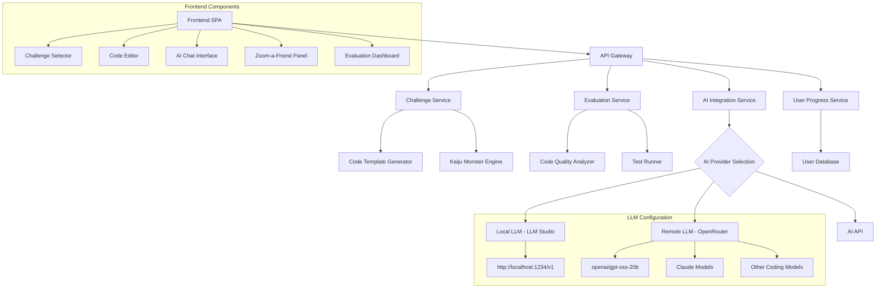

# Design Document

## Overview

Kiro Kaiji: Refactor Rampage is a single-page web application (SPA) built with modern web technologies to provide an engaging, gamified coding education experience. The application uses a component-based architecture with responsive design principles to ensure seamless functionality across desktop and mobile devices. The core gameplay loop involves challenge generation, code editing, AI assistance, peer consultation, and automated evaluation.

## Architecture

### High-Level Architecture



### Technology Stack

- **Frontend**: Vue 3 with TypeScript for component-based UI
- **Styling**: Tailwind CSS for responsive design and theming
- **Code Editor**: Monaco Editor (VS Code editor) with syntax highlighting
- **State Management**: Pinia for Vue state management
- **API Communication**: Axios for HTTP requests
- **Build Tool**: Vite for fast development and optimized builds
- **Testing**: Vitest and Vue Testing Library
- **Deployment**: Local development with Kiro integration OR AWS services with OpenRouter API for AI

### Deployment Modes

#### Local Mode (Kiro IDE Integration)
- **File Management**: Kiro IDE handles file modifications directly in the local workspace
- **Code Submission**: Users submit code through the locally running application
- **AI Integration**: Direct integration with Kiro's built-in AI capabilities
- **Benefits**: No external dependencies, immediate feedback, full IDE integration

#### AWS Cloud Mode with Flexible AI Provider Options
- **Infrastructure**: AWS Lambda functions for serverless backend services
- **Storage**: AWS DynamoDB for user progress and challenge data
- **Cost Management**: Configurable spending limits with default $15/month budget
- **AI Provider Options**:
  - **Local LLM**: OpenAI-compatible endpoint (default: http://localhost:1234/v1) using LLM Studio or similar
  - **Remote LLM**: OpenRouter API with preferred models (openai/gpt-oss-20b, Claude, other coding-focused models)
- **Benefits**: Scalable, multi-user support, persistent data storage, flexible AI provider options, cost-controlled deployment

### AI Provider Selection Strategy

#### Local LLM Configuration (Requirement 9.1, 9.5)
```typescript
interface LocalLLMConfig {
  defaultEndpoint: 'http://localhost:1234/v1'; // OpenAI-compatible endpoint default (Requirement 9.1)
  connectionTimeout: number;
  retryAttempts: number;
  fallbackBehavior: 'error-message' | 'switch-to-remote' | 'offline-mode';
  healthCheck: {
    endpoint: '/v1/models';
    interval: number;
    failureThreshold: number;
  };
  errorHandling: {
    unreachableEndpoint: boolean; // Clear error messages when local LLM endpoint is unreachable (Requirement 9.5)
    fallbackOptions: string[]; // Provide fallback options when local endpoint fails (Requirement 9.5)
  };
}
```

#### Remote LLM Configuration (Requirement 9.2, 9.4, 9.6)
```typescript
interface RemoteLLMConfig {
  provider: 'openrouter'; // OpenRouter API usage (Requirement 9.2)
  preferredModels: ['openai/gpt-oss-20b', 'claude-3-haiku', 'coding-focused-models']; // Preferred models including openai/gpt-oss-20b and Claude (Requirement 9.2)
  fallbackStrategy: {
    automaticFallback: boolean; // Automatic fallback to other coding-focused models when preferred unavailable (Requirement 9.4)
    fallbackOrder: string[]; // Ordered list of fallback coding-focused models (Requirement 9.4)
    costOptimization: 'free-tier-priority' | 'performance-priority'; // Optimize for free tier usage (Requirement 9.6)
  };
  rateLimiting: {
    requestDelay: number; // Small delay to avoid hitting quotas (Requirement 9.3)
    quotaManagement: boolean;
    costTracking: boolean;
    costAwareModelSelection: boolean; // Cost-aware model selection for free tier (Requirement 9.6)
  };
  budgetManagement: {
    monthlyBudgetLimit: number; // Default: $15/month spending limit
    costAlerts: boolean; // Alert when approaching budget limits
    automaticShutoff: boolean; // Stop services when budget exceeded
    budgetTracking: 'daily' | 'weekly' | 'monthly'; // Budget monitoring frequency
  };
}
```

#### AI Provider Abstraction Layer (Requirement 9)
The system implements a unified interface that abstracts the differences between AI providers to support flexible AI provider options:

```typescript
interface AIProviderInterface {
  provider: 'kiro' | 'local' | 'remote';
  isAvailable: () => Promise<boolean>;
  sendRequest: (prompt: string, options: RequestOptions) => Promise<string>;
  getAvailableModels: () => Promise<string[]>;
  handleError: (error: AIProviderError) => AIProviderResponse;
  implementRequestDelay: () => Promise<void>; // Small delay to avoid hitting quotas (Requirement 9.3)
}

interface AIProviderError {
  type: 'connection-failed' | 'model-unavailable' | 'quota-exceeded' | 'invalid-response';
  provider: string;
  originalError: Error;
  fallbackOptions: string[];
  isLocalEndpointUnreachable?: boolean; // Specific handling for local LLM connection issues (Requirement 9.5)
}
```

## Components and Interfaces

### Core Components

#### 1. Challenge Selector Component
```typescript
interface ChallengeConfig {
  language: ProgrammingLanguage;
  framework?: Framework; // Optional front-end framework selection
  category: ChallengeCategory;
  difficulty: DifficultyLevel;
}

interface ChallengeSelector {
  onConfigChange: (config: ChallengeConfig) => void;
  onGenerateChallenge: () => void;
  isLoading: boolean;
  activeChallenges: Challenge[]; // Support multiple active challenges simultaneously
  frameworkOptions: Framework[]; // Dynamic framework options based on selected language
  isGenerateEnabled: boolean; // Button state management based on required parameter selection
}

interface ChallengeTransition {
  smoothTransition: boolean; // Ensure smooth transition to challenge after generation
  autoOpen: boolean; // Automatically open challenge after generation (Requirement 1.4)
}

interface FrameworkFiltering {
  updateFrameworkOptions: (language: ProgrammingLanguage) => Framework[];
  validateRequiredParameters: (config: ChallengeConfig) => boolean;
}
```

#### 2. Kaiju Monster Engine
```typescript
interface KaijuMonster {
  id: string;
  name: string;
  description: string;
  avatar: string; // Image path from src/assets/images/kaiju/ directory
  codePatterns: CodeAntiPattern[];
  difficultyModifiers: DifficultyModifier[];
}

enum KaijuType {
  HYDRA_BUG = 'hydra-bug',
  COMPLEXASAUR = 'complexasaur',
  DUPLICATRON = 'duplicatron',
  SPAGHETTIZILLA = 'spaghettizilla',
  MEMORYLEAK_ODACTYL = 'memoryleak-odactyl'
}

interface KaijuImageMapping {
  'hydra-bug': 'src/assets/images/kaiju/HydraBug_small.png';
  'complexasaur': 'src/assets/images/kaiju/Complexosaur_small.png';
  'duplicatron': 'src/assets/images/kaiju/Duplicatron_small.png';
  'spaghettizilla': 'src/assets/images/kaiju/Speghettizilla_small.png';
  'memoryleak-odactyl': 'src/assets/images/kaiju/MemoryLeakodactyl_small.png';
}
```

#### 3. Code Editor Interface
```typescript
interface CodeEditorProps {
  initialCode: string;
  language: string;
  onChange: (code: string) => void;
  readOnly?: boolean;
  theme: 'light' | 'dark';
}
```

#### 4. AI Chat Interface
```typescript
interface AIChatMessage {
  id: string;
  role: 'user' | 'assistant';
  content: string;
  timestamp: Date;
  context?: ChallengeContext;
}

interface AIChatInterface {
  messages: AIChatMessage[];
  onSendMessage: (message: string) => void;
  isLoading: boolean;
  challengeContext: ChallengeContext;
  autoScrollBehavior: 'smooth' | 'instant'; // Auto-scroll to bottom at reading speed
  scrollSpeed: number; // Average reading speed for smooth scrolling
  markdownToHtml: boolean; // Convert Markdown format to HTML for AI Assistant messages (Requirement 3.7)
  uiLabels: {
    assistantName: 'AI Assistant'; // Display "AI Assistant" instead of "Kiro AI Assistant"
    helpButtonText: 'Ask AI for help'; // Display "Ask AI for help" instead of "Ask Kiro AI for help"
    chatTitle: 'AI'; // Display "AI" in chat interface
  };
}

interface AIServiceConfig {
  provider: 'kiro' | 'local' | 'remote';
  localEndpoint?: string; // Default: http://localhost:1234/v1
  remoteApiKey?: string;
  remoteModel?: string; // Preferred: openai/gpt-oss-20b, Claude
  requestDelay: number; // Small delay to avoid quota issues
  maxTokens: number;
  temperature: number;
  fallbackModels: string[]; // Automatic fallback to other coding-focused models
  errorHandling: {
    localEndpointUnreachable: boolean;
    remoteModelUnavailable: boolean;
    quotaExceeded: boolean;
  };
}

interface AICapabilities {
  refactoringAssistance: boolean; // Provide specific code structure improvements
  testGeneration: boolean; // Generate appropriate unit test cases
  requirementImplementation: boolean; // Guide through implementation process
  contextMaintenance: boolean; // Maintain challenge and code state context
  markdownRendering: boolean; // Convert Markdown format to HTML for message display (Requirement 3.7)
}
```

#### 5. Zoom-a-Friend Panel
```typescript
interface TeamMember {
  id: string;
  role: TeamRole;
  avatar: AnimalAvatar;
  name: string;
  specialties: string[];
  dialogStyle: DialogStyle; // Animal-themed communication patterns
  imagePath: string; // Image path from src/assets/images/team/ directory
}

enum TeamRole {
  QA = 'quality-assurance', // Pufferfish - defects and bugs focus (Requirement 4.2)
  ARCHITECT = 'architect', // Owl - architectural advice with "Architecture" and "Redundancy" (Requirement 4.3)
  PRODUCT_OWNER = 'product-owner', // Pig - requirements clarification (Requirement 4.4)
  SENIOR_DEVELOPER = 'senior-developer' // Cat - coding best practices (Requirement 4.5)
}

enum AnimalAvatar {
  PUFFERFISH = 'pufferfish', // Quality Assurance role
  OWL = 'owl', // Architect role
  PIG = 'pig', // Product Owner role
  CAT = 'cat' // Senior Developer role
}

interface TeamMemberImageMapping {
  'quality-assurance': 'src/assets/images/team/quality-assurance_sm.png';
  'architect': 'src/assets/images/team/architect_sm.png';
  'product-owner': 'src/assets/images/team/product-owner_sm.png';
  'senior-developer': 'src/assets/images/team/senior-developer_sm.png';
}

interface DialogStyle {
  animalSounds: string[]; // Primary communication through animal sounds (Requirement 4.6)
  keyTerms: string[]; // Technical terms interspersed in dialog (Requirement 4.6)
  communicationPattern: 'mostly-sounds' | 'balanced' | 'technical-heavy';
  specialKeywords?: string[]; // Role-specific keywords (e.g., "Architecture", "Redundancy" for Owl)
}

interface ZoomAFriendInteraction {
  displaySelection: boolean; // Show animal icons with role titles underneath (Requirement 4.1)
  roleSpecificAdvice: {
    qa: 'defects-and-bugs-focused'; // Pufferfish AI dialog (Requirement 4.2)
    architect: 'architectural-with-owl-themes'; // Owl-themed AI dialog (Requirement 4.3)
    productOwner: 'requirements-clarification'; // AI Product Owner dialog (Requirement 4.4)
    seniorDeveloper: 'coding-best-practices'; // Software Development AI themed dialog (Requirement 4.5)
  };
  codeCommentGeneration: boolean; // Add AI-generated comments to existing code
  markdownToHtml: boolean; // Convert Markdown format to HTML for Zoom-A-Friend messages (Requirement 4.7)
}
```

#### 6. Visual Display Component
```typescript
interface VisualDisplayComponent {
  currentImage: string;
  displayType: 'kaiju' | 'team-member';
  position: 'left-sidebar'; // Between Progress link and Deployment Mode chooser
  imageTransition: 'smooth' | 'instant';
}

interface KaijuDisplay {
  showKaijuImage: (kaijuType: KaijuType) => void;
  kaijuImagePath: string; // From assets/images/kaiju/ directory
  kaijuFullImagePath: string; // kaijuImagePath w/o _small
  displayOnChallengeSelection: boolean; // Show Kaiju image when challenge is first selected
}

interface TeamMemberDisplay {
  showTeamMemberImage: (teamRole: TeamRole) => void;
  teamMemberImagePath: string; // From assets/images/team/${TeamRole}_sm.png in public
  teamMemberFullImagePath: string; // teamMemberImagePath w/o "_sm"
  displayOnZoomAFriendClick: boolean; // Show team member image when Zoom-a-Friend is clicked
  replaceKaijuImage: boolean; // Replace Kaiju image with team member image
}

interface ImageDisplayLogic {
  defaultState: 'no-image' | 'placeholder';
  challengeSelectedState: 'show-kaiju-image';
  zoomAFriendClickedState: 'show-team-member-image';
  imageSourceMapping: {
    kaiju: KaijuImageMapping;
    teamMember: TeamMemberImageMapping;
  };
}
```

#### 7. AI Grading Service
```typescript
interface AIGradingService {
  submitForGrading: (challengeId: string, code: string) => Promise<AIGradingResponse>; // "Submit Code for Grading" button workflow (Requirement 8.1)
  getAvailableModels: () => Promise<string[]>;
  selectSingleModel: (availableModels: string[]) => string;
  evaluateAllRoles: (code: string, model: string, requirements: string[]) => Promise<AIGradingResponse>; // Single AI model for all four role perspectives (Requirement 8.2)
  parseRoleEvaluations: (response: string) => Record<GradingRole, [number, string]>; // Parse JSON response format (Requirement 8.3)
  calculateAverageScore: (roleScores: Record<GradingRole, [number, string]>) => number; // Calculate average overall score (Requirement 8.8)
  recordGradingHistory: (userId: string, gradingResult: AIGradingResponse) => Promise<void>; // Record scores in Progress page (Requirement 8.9)
}

interface GradingPrompts {
  [GradingRole.DEVELOPER]: {
    systemPrompt: string;
    focusAreas: ['code quality', 'best practices', 'maintainability', 'technical implementation']; // Requirement 8.4
    evaluationCriteria: ['clean code principles', 'SOLID principles', 'error handling', 'performance'];
  };
  [GradingRole.ARCHITECT]: {
    systemPrompt: string;
    focusAreas: ['system design', 'scalability', 'patterns', 'architectural decisions']; // Requirement 8.5
    evaluationCriteria: ['design patterns', 'separation of concerns', 'modularity', 'extensibility'];
  };
  [GradingRole.SQA]: {
    systemPrompt: string;
    focusAreas: ['defects', 'edge cases', 'testing coverage', 'quality assurance']; // Requirement 8.6
    evaluationCriteria: ['bug detection', 'test completeness', 'edge case handling', 'validation'];
  };
  [GradingRole.PRODUCT_OWNER]: {
    systemPrompt: string;
    focusAreas: ['requirement fulfillment', 'user experience', 'business value']; // Requirement 8.7
    evaluationCriteria: ['requirement compliance', 'usability', 'feature completeness', 'user value'];
  };
}

interface UnifiedGradingPrompt {
  systemPrompt: string;
  roleInstructions: {
    developer: string; // Detailed prompts for code quality, best practices, maintainability, technical implementation (Requirement 8.4)
    architect: string; // Detailed prompts for system design, scalability, patterns, architectural decisions (Requirement 8.5)
    sqa: string; // Detailed prompts for defects, edge cases, testing coverage, quality assurance (Requirement 8.6)
    productOwner: string; // Detailed prompts for requirement fulfillment, user experience, business value (Requirement 8.7)
  };
  responseFormat: string; // JSON format: {"developer": [score, "reason"], "architect": [score, "reason"], "sqa": [score, "reason"], "productOwner": [score, "reason"]} (Requirement 8.3)
  fallbackModel: string; // Default model if none available
}
```

### API Interfaces

#### Challenge Generation API
```typescript
interface ChallengeRequest {
  language: string;
  framework?: string;
  category: string;
  difficulty: number;
  userId?: string;
}

interface ChallengeResponse {
  id: string;
  kaiju: KaijuMonster;
  initialCode: string;
  requirements: string[];
  testCases: TestCase[];
  hints: string[];
}
```

#### Evaluation API
```typescript
interface EvaluationRequest {
  challengeId: string;
  submittedCode: string;
  userId?: string;
}

interface EvaluationResponse {
  scores: {
    readability: number; // Code readability using automated metrics (Requirement 5.1)
    quality: number; // Code quality including maintainability and best practices (Requirement 5.2)
    defects: number; // Defects and bugs through automated testing (Requirement 5.3)
    requirements: number; // Verification that all new requirements are implemented (Requirement 5.4)
    overall: number;
  };
  feedback: EvaluationFeedback[]; // Detailed score breakdown with specific feedback for improvement (Requirement 5.5)
  achievements?: Achievement[];
}
```

#### AI Grading API
```typescript
interface AIGradingRequest {
  challengeId: string;
  submittedCode: string;
  requirements: string[];
  userId?: string;
}

interface RoleEvaluation {
  role: GradingRole;
  score: number;
  feedback: string;
}

interface AIGradingResponse {
  challengeId: string;
  modelUsed: string;
  roleEvaluations: Record<GradingRole, RoleEvaluation>;
  averageScore: number;
  rawResponse: Record<GradingRole, [number, string]>; // Format: {"developer": [score, "reason"], ...}
  gradingTimestamp: Date;
}

enum GradingRole {
  DEVELOPER = 'developer',
  ARCHITECT = 'architect',
  SQA = 'sqa',
  PRODUCT_OWNER = 'product-owner'
}

interface UnifiedGradingRequest {
  code: string;
  requirements: string[];
  model: string;
  unifiedPrompt: string; // Single prompt requesting all four role evaluations
  expectedFormat: string; // JSON format: {"developer": [score, "reason"], ...}
}
```

## AI-Based Multi-Role Grading System

### Design Rationale
The AI-based grading system addresses Requirement 8 by providing comprehensive feedback from multiple professional perspectives. The design uses a single AI model approach to ensure consistency and reduce API costs while still providing diverse role-based evaluations.

### Unified Grading Architecture
```typescript
interface UnifiedGradingSystem {
  modelSelection: {
    queryAvailableModels: () => Promise<string[]>; // Query /v1/models endpoint
    selectOptimalModel: (available: string[]) => string; // Choose best available model
    fallbackStrategy: string[]; // Ordered list of fallback models
  };
  
  singleRequestEvaluation: {
    unifiedPrompt: string; // Single prompt requesting all four role evaluations
    expectedResponseFormat: 'json'; // {"developer": [score, "reason"], ...}
    roleInstructions: Record<GradingRole, RoleInstruction>;
  };
  
  responseProcessing: {
    parseJSON: (response: string) => Record<GradingRole, [number, string]>;
    calculateAverage: (roleScores: Record<GradingRole, [number, string]>) => number;
    generateFeedback: (roleEvaluations: Record<GradingRole, RoleEvaluation>) => string;
  };
}

interface RoleInstruction {
  systemPrompt: string;
  focusAreas: string[];
  evaluationCriteria: string[];
  scoringGuidelines: string;
}

interface GradingWorkflow {
  step1: 'submit-code-for-grading-button';
  step2: 'query-available-models';
  step3: 'select-single-optimal-model';
  step4: 'send-unified-prompt-to-model';
  step5: 'parse-json-response-with-all-roles';
  step6: 'display-individual-and-average-scores';
  step7: 'record-scores-in-progress-tracking';
}
```

### Role-Specific Evaluation Criteria

#### Developer Role Evaluation (Requirement 8.4)
- **Focus Areas**: Code quality, best practices, maintainability, technical implementation
- **Evaluation Criteria**: Clean code principles, SOLID principles, error handling, performance
- **Scoring Weight**: Equal weight with other roles in average calculation
- **Prompt Focus**: Detailed evaluation of technical implementation and coding standards

#### Architect Role Evaluation (Requirement 8.5)
- **Focus Areas**: System design, scalability, patterns, architectural decisions
- **Evaluation Criteria**: Design patterns, separation of concerns, modularity, extensibility
- **Scoring Weight**: Equal weight with other roles in average calculation
- **Prompt Focus**: Detailed evaluation of architectural soundness and design patterns

#### SQA Role Evaluation (Requirement 8.6)
- **Focus Areas**: Defects, edge cases, testing coverage, quality assurance concerns
- **Evaluation Criteria**: Bug detection, test completeness, edge case handling, validation
- **Scoring Weight**: Equal weight with other roles in average calculation
- **Prompt Focus**: Detailed evaluation of quality assurance and defect identification

#### Product Owner Role Evaluation (Requirement 8.7)
- **Focus Areas**: Requirement fulfillment, user experience, business value delivery
- **Evaluation Criteria**: Requirement compliance, usability, feature completeness, user value
- **Scoring Weight**: Equal weight with other roles in average calculation
- **Prompt Focus**: Detailed evaluation of business value and requirement satisfaction

### Progress Tracking Integration (Requirement 8.9)
The grading system integrates with the user progress tracking to provide:
- Historical trend analysis across all role perspectives
- Individual role improvement tracking over time (recorded in user's Progress page)
- Average score progression for overall skill development
- Challenge-specific performance patterns by Kaiju type
- Persistent storage of individual role scores and average scores for long-term tracking

## Data Models

### Challenge Model
```typescript
interface Challenge {
  id: string;
  kaiju: KaijuMonster;
  config: ChallengeConfig;
  initialCode: string;
  requirements: Requirement[];
  testCases: TestCase[];
  createdAt: Date;
  timeLimit?: number;
}

interface Requirement {
  id: string;
  description: string;
  priority: 'must' | 'should' | 'could';
  testable: boolean;
}
```

### User Progress Model
```typescript
interface UserProgress {
  userId: string;
  completedChallenges: string[];
  achievements: Achievement[]; // Achievement badges for defeating specific Kaiju types (Requirement 7.4)
  stats: {
    totalChallenges: number; // Statistics on challenges completed (Requirement 7.3)
    averageScore: number; // Average scores tracking (Requirement 7.3)
    kaijuDefeated: Record<KaijuType, number>; // Track Kaiju defeats for achievement system (Requirement 7.4)
    improvementTrend: number[]; // Improvement trends display (Requirement 7.3)
  };
  unlockedDifficulties: DifficultyLevel[]; // Unlock higher difficulty levels based on high scores (Requirement 7.2)
  gradingHistory: GradingHistoryEntry[]; // Track AI grading results over time
  milestones: Milestone[]; // Milestone tracking with encouraging feedback (Requirement 7.5)
  createdAt: Date; // Progress profile creation on first challenge completion (Requirement 7.1)
  updatedAt: Date;
}

interface Milestone {
  id: string;
  name: string;
  description: string;
  achieved: boolean;
  achievedAt?: Date;
  encouragingFeedback: string; // Encouraging feedback when milestones are reached (Requirement 7.5)
  unlocksSpecialChallenges?: string[]; // Special challenges unlocked by milestones (Requirement 7.5)
}

interface GradingHistoryEntry {
  challengeId: string;
  gradingTimestamp: Date;
  roleScores: Record<GradingRole, number>; // Individual scores from each role perspective (Requirement 8.8, 8.9)
  averageScore: number; // Calculated average of all role scores (Requirement 8.8, 8.9)
  modelUsed: string; // Single AI model used for unified evaluation (Requirement 8.2)
  challengeType: string;
  kaijuType: KaijuType;
  rawResponse: Record<GradingRole, [number, string]>; // Original AI response format: {"developer": [score, "reason"], ...} (Requirement 8.3)
}
```

### Zoom-a-Friend Dialog Model
```typescript
interface DialogResponse {
  teamMember: TeamMember;
  message: string;
  animalSounds: string[]; // Majority of dialog consists of animal sounds
  keyTerms: string[]; // Technical terms interspersed throughout
  advice: string;
  mood: 'happy' | 'concerned' | 'excited' | 'frustrated';
  codeComments?: CodeComment[]; // AI-generated code comments for existing code
  roleSpecificFocus: RoleSpecificFocus;
}

interface RoleSpecificFocus {
  qa: {
    focus: 'defects-and-bugs';
    dialogTheme: 'pufferfish-sounds-with-qa-terms';
  };
  architect: {
    focus: 'architectural-advice';
    dialogTheme: 'owl-sounds-with-architecture-and-redundancy';
    keyWords: ['Architecture', 'Redundancy'];
  };
  productOwner: {
    focus: 'requirements-clarification';
    dialogTheme: 'pig-sounds-with-product-terms';
  };
  seniorDeveloper: {
    focus: 'coding-best-practices';
    dialogTheme: 'cat-sounds-with-development-terms';
  };
}

interface CodeComment {
  lineNumber: number;
  comment: string;
  type: 'suggestion' | 'warning' | 'info' | 'improvement';
  role: TeamRole; // Which team member provided this comment
}

interface ZoomAFriendService {
  generateRoleBasedAdvice: (code: string, role: TeamRole) => Promise<DialogResponse>;
  addCodeComments: (code: string, comments: CodeComment[]) => string;
  getAIDialogForRole: (role: TeamRole, context: ChallengeContext) => Promise<string>;
  createAnimalThemedDialog: (role: TeamRole, technicalContent: string) => string;
  convertMarkdownToHtml: (markdownContent: string) => string; // Convert Markdown to HTML for Zoom-A-Friend messages (Requirement 4.7)
}
```

## Error Handling

### Error Categories
1. **Network Errors**: API timeouts, connection failures
2. **Validation Errors**: Invalid code submissions, malformed requests
3. **Generation Errors**: Challenge creation failures, AI service unavailable
4. **Evaluation Errors**: Code compilation failures, test execution errors
5. **AI Provider Errors**: Local LLM unreachable, remote model unavailable, quota exceeded (Requirement 9.5, 9.4)
6. **Budget Errors**: AWS spending limits exceeded, cost alerts triggered

### Error Handling Strategy
```typescript
interface AppError {
  code: string;
  message: string;
  severity: 'low' | 'medium' | 'high';
  recoverable: boolean;
  userMessage: string;
  aiProviderContext?: AIProviderError;
}

class ErrorHandler {
  static handle(error: AppError): void {
    // Log error for monitoring
    // Show user-friendly message
    // Attempt recovery if possible
    // Fallback to offline mode if needed
    
    // AI Provider specific error handling (Requirement 9.5, 9.4)
    if (error.aiProviderContext) {
      this.handleAIProviderError(error.aiProviderContext);
    }
  }
  
  static handleAIProviderError(error: AIProviderError): void {
    switch (error.type) {
      case 'connection-failed':
        // Local LLM unreachable - provide clear error message and fallback options
        this.showLocalLLMConnectionError();
        break;
      case 'model-unavailable':
        // Remote model unavailable - automatically fallback to other coding-focused models
        this.attemptModelFallback(error.fallbackOptions);
        break;
      case 'quota-exceeded':
        // Implement request delay and quota management
        this.handleQuotaExceeded();
        break;
      case 'budget-exceeded':
        // AWS spending limit reached - disable services and notify user
        this.handleBudgetExceeded();
        break;
    }
  }
  
  static handleBudgetExceeded(): void {
    // Disable AWS services when monthly budget limit is reached
    // Provide clear notification to user about budget status
    // Offer options to increase budget or switch to local mode
  }
}
```

### Offline Capabilities
- Cache previously generated challenges for offline practice
- Store user progress locally with sync when online
- Provide basic code validation without server evaluation

## Testing Strategy

### Unit Testing
- Component testing with Vue Testing Library
- Service layer testing with Vitest
- Mock API responses for consistent testing
- Code coverage target: 85%

### Integration Testing
- End-to-end challenge flow testing
- AI integration testing with mock responses
- Evaluation pipeline testing
- Mobile responsiveness testing

### Performance Testing
- Code editor performance with large files
- Challenge generation speed benchmarks
- Mobile device performance validation
- API response time monitoring

### User Experience Testing
- Accessibility compliance (WCAG 2.1 AA)
- Cross-browser compatibility testing
- Mobile touch interaction testing
- Kaiju animation performance testing

## AWS Cost Management System

### Budget Control Architecture
The AWS deployment includes comprehensive cost management to ensure spending stays within configurable limits.

#### Cost Management Configuration
```typescript
interface AWSCostManagement {
  budgetSettings: {
    monthlyLimit: number; // Default: $15/month
    alertThresholds: [50, 80, 95]; // Percentage thresholds for alerts
    automaticShutoff: boolean; // Stop services when budget exceeded
    gracePeriod: number; // Hours before automatic shutoff after budget exceeded
  };
  
  costTracking: {
    services: ['lambda', 'dynamodb', 'bedrock', 'apigateway'];
    granularity: 'daily' | 'hourly';
    reportingFrequency: 'daily' | 'weekly';
    costBreakdown: boolean; // Track costs by service and feature
  };
  
  budgetEnforcement: {
    preventNewRequests: boolean; // Block new API calls when budget exceeded
    degradeToLocalMode: boolean; // Automatically switch to local LLM when budget reached
    userNotifications: boolean; // Send budget alerts to users
    adminNotifications: boolean; // Send budget alerts to administrators
  };
}
```

#### Cost Optimization Strategies
- **Lambda Functions**: Use ARM-based processors for cost efficiency
- **DynamoDB**: On-demand pricing with auto-scaling to minimize costs
- **AI Services**: Prefer free-tier models and implement request batching
- **API Gateway**: Optimize request routing to reduce invocation costs
- **Monitoring**: AWS CloudWatch for real-time cost tracking and alerts

#### Budget Alert System
```typescript
interface BudgetAlert {
  threshold: number; // Percentage of budget consumed
  alertType: 'email' | 'in-app' | 'webhook';
  message: string;
  actionRequired: boolean;
  suggestedActions: string[]; // Recommendations to reduce costs
}

interface BudgetEnforcement {
  softLimit: number; // 80% - Show warnings and suggestions
  hardLimit: number; // 100% - Disable AWS services, switch to local mode
  emergencyShutoff: boolean; // Immediate service shutdown at 110% budget
}
```

#### Cost-Aware Feature Design
- **Challenge Generation**: Cache generated challenges to reduce AI API calls
- **Evaluation**: Use local evaluation when possible, AI evaluation for premium features
- **Progress Tracking**: Store data efficiently in DynamoDB with minimal read/write operations
- **User Sessions**: Implement session management to reduce authentication overhead

## Message Rendering System

### Markdown to HTML Conversion
The application implements a comprehensive message rendering system to handle AI Assistant and Zoom-A-Friend communications that may contain formatted content.

#### Design Rationale
AI responses often include code snippets, lists, emphasis, and other formatted content that benefits from proper HTML rendering rather than plain text display. This enhances readability and user experience when receiving technical guidance.

#### Implementation Strategy
```typescript
interface MessageRenderer {
  convertMarkdownToHtml: (content: string) => string;
  sanitizeHtml: (htmlContent: string) => string; // Security: prevent XSS attacks
  supportedMarkdownFeatures: [
    'code-blocks',
    'inline-code',
    'bold-italic',
    'lists',
    'links',
    'headers'
  ];
  renderingOptions: {
    codeHighlighting: boolean; // Syntax highlighting for code blocks
    linkTargetBlank: boolean; // Open links in new tabs
    sanitization: 'strict' | 'moderate'; // HTML sanitization level
  };
}

interface AIMessageDisplay {
  rawContent: string; // Original AI response content
  renderedContent: string; // HTML-rendered content for display
  renderingTimestamp: Date;
  contentType: 'ai-assistant' | 'zoom-a-friend';
}
```

#### Security Considerations
- All HTML content is sanitized to prevent XSS attacks
- Only safe HTML tags and attributes are allowed
- External links are configured to open in new tabs
- Code blocks are syntax-highlighted but not executed

#### Supported Markdown Features
- **Code Blocks**: Syntax-highlighted code examples
- **Inline Code**: Monospace formatting for code snippets
- **Emphasis**: Bold and italic text formatting
- **Lists**: Ordered and unordered lists for structured content
- **Links**: Clickable links to external resources
- **Headers**: Section headers for organized content

## Mobile Responsiveness Design

### Breakpoint Strategy
- Mobile: 320px - 768px
- Tablet: 768px - 1024px  
- Desktop: 1024px+

### Visual Display System
- **Left Sidebar Image Display**: Small image positioned between Progress link and Deployment Mode chooser
- **Kaiju Image Display**: Show Kaiju monster image when challenge is first selected (from src/assets/images/kaiju/)
- **Team Member Image Display**: Replace Kaiju image with team member image when Zoom-a-Friend is clicked (from src/assets/images/team/${TeamRole}_sm.png)
- **Smooth Image Transitions**: Seamless switching between Kaiju and team member images
- **Responsive Image Sizing**: Appropriate image scaling for different screen sizes

### Mobile-Specific Features
- **Touch-Optimized Interface**: Responsive interface optimized for touch interaction (Requirement 6.1)
- **Code Editor Mobile Support**: Touch-optimized code editor with horizontal scrolling and appropriate text sizing (Requirement 6.2)
- **AI Chat Mobile Usability**: AI chat interface maintains full functionality with touch-friendly controls on mobile devices (Requirement 6.3)
- **Zoom-a-Friend Mobile Optimization**: Avatar interface optimized for smaller screens with touch-friendly selection (Requirement 6.4)
- **Functionality Parity**: Same functionality between mobile and desktop users for code submission and all features (Requirement 6.5)
- **Visual Display Mobile Adaptation**: Left sidebar image display adapts appropriately for mobile layouts
- Swipe gestures for navigation between sections
- Optimized virtual keyboard handling for code input
- Reduced animation complexity for better performance
- Collapsible panels for space optimization on smaller screens

### Progressive Enhancement
- Core functionality works without JavaScript
- Enhanced features load progressively
- Graceful degradation for older browsers
- Offline-first approach with service workers

## Security Considerations

### Code Execution Safety
- All user code runs in sandboxed environments
- No server-side code execution of user submissions
- Static analysis only for evaluation
- Input sanitization for all user-generated content

### Data Privacy
- Minimal user data collection
- Local storage for progress when possible
- GDPR compliance for EU users
- No sensitive data in client-side code

## Performance Optimization

### Code Splitting
- Lazy load challenge components
- Separate bundles for different Kaiju monsters
- Dynamic imports for AI chat functionality

### Caching Strategy
- Service worker for offline functionality
- Browser caching for static assets
- API response caching for repeated requests
- Code template caching for faster generation