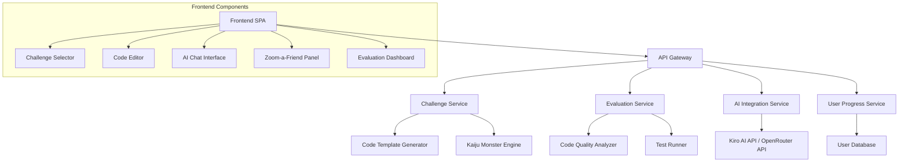

# Design Document

## Overview

Kiro Kaiji: Refactor Rampage is a single-page web application (SPA) built with modern web technologies to provide an engaging, gamified coding education experience. The application uses a component-based architecture with responsive design principles to ensure seamless functionality across desktop and mobile devices. The core gameplay loop involves challenge generation, code editing, AI assistance, peer consultation, and automated evaluation.

## Architecture

### High-Level Architecture



### Technology Stack

- **Frontend**: Vue 3 with TypeScript for component-based UI
- **Styling**: Tailwind CSS for responsive design and theming
- **Code Editor**: Monaco Editor (VS Code editor) with syntax highlighting
- **State Management**: Pinia for Vue state management
- **API Communication**: Axios for HTTP requests
- **Build Tool**: Vite for fast development and optimized builds
- **Testing**: Vitest and Vue Testing Library
- **Deployment**: Local development with Kiro integration OR AWS services with OpenRouter API for AI

### Deployment Modes

#### Local Mode
- **File Management**: Kiro IDE handles file modifications directly in the local workspace
- **Code Submission**: Users submit code through the locally running application
- **AI Integration**: Direct integration with Kiro's built-in AI capabilities
- **Benefits**: No external dependencies, immediate feedback, full IDE integration

#### AWS Cloud Mode  
- **Infrastructure**: AWS Lambda functions for serverless backend services
- **AI Provider**: OpenRouter API for AI-powered code assistance and evaluation
- **Storage**: AWS DynamoDB for user progress and challenge data
- **Benefits**: Scalable, multi-user support, persistent data storage

## Components and Interfaces

### Core Components

#### 1. Challenge Selector Component
```typescript
interface ChallengeConfig {
  language: ProgrammingLanguage;
  framework?: Framework;
  category: ChallengeCategory;
  difficulty: DifficultyLevel;
}

interface ChallengeSelector {
  onConfigChange: (config: ChallengeConfig) => void;
  onGenerateChallenge: () => void;
  isLoading: boolean;
}
```

#### 2. Kaiju Monster Engine
```typescript
interface KaijuMonster {
  id: string;
  name: string;
  description: string;
  avatar: string;
  codePatterns: CodeAntiPattern[];
  difficultyModifiers: DifficultyModifier[];
}

enum KaijuType {
  HYDRA_BUG = 'hydra-bug',
  COMPLEXASAUR = 'complexasaur',
  DUPLICATRON = 'duplicatron',
  SPAGHETTIZILLA = 'spaghettizilla',
  MEMORYLEAK_ODACTYL = 'memoryleak-odactyl'
}
```

#### 3. Code Editor Interface
```typescript
interface CodeEditorProps {
  initialCode: string;
  language: string;
  onChange: (code: string) => void;
  readOnly?: boolean;
  theme: 'light' | 'dark';
}
```

#### 4. AI Chat Interface
```typescript
interface AIChatMessage {
  id: string;
  role: 'user' | 'assistant';
  content: string;
  timestamp: Date;
  context?: ChallengeContext;
}

interface AIChatInterface {
  messages: AIChatMessage[];
  onSendMessage: (message: string) => void;
  isLoading: boolean;
  challengeContext: ChallengeContext;
}
```

#### 5. Zoom-a-Friend Panel
```typescript
interface TeamMember {
  id: string;
  role: TeamRole;
  avatar: AnimalAvatar;
  name: string;
  specialties: string[];
}

enum TeamRole {
  QA = 'quality-assurance',
  ARCHITECT = 'architect',
  PRODUCT_OWNER = 'product-owner',
  SENIOR_DEVELOPER = 'senior-developer'
}

enum AnimalAvatar {
  PUFFERFISH = 'pufferfish',
  OWL = 'owl',
  PIG = 'pig',
  CAT = 'cat'
}
```

### API Interfaces

#### Challenge Generation API
```typescript
interface ChallengeRequest {
  language: string;
  framework?: string;
  category: string;
  difficulty: number;
  userId?: string;
}

interface ChallengeResponse {
  id: string;
  kaiju: KaijuMonster;
  initialCode: string;
  requirements: string[];
  testCases: TestCase[];
  hints: string[];
}
```

#### Evaluation API
```typescript
interface EvaluationRequest {
  challengeId: string;
  submittedCode: string;
  userId?: string;
}

interface EvaluationResponse {
  scores: {
    readability: number;
    quality: number;
    defects: number;
    requirements: number;
    overall: number;
  };
  feedback: EvaluationFeedback[];
  achievements?: Achievement[];
}
```

## Data Models

### Challenge Model
```typescript
interface Challenge {
  id: string;
  kaiju: KaijuMonster;
  config: ChallengeConfig;
  initialCode: string;
  requirements: Requirement[];
  testCases: TestCase[];
  createdAt: Date;
  timeLimit?: number;
}

interface Requirement {
  id: string;
  description: string;
  priority: 'must' | 'should' | 'could';
  testable: boolean;
}
```

### User Progress Model
```typescript
interface UserProgress {
  userId: string;
  completedChallenges: string[];
  achievements: Achievement[];
  stats: {
    totalChallenges: number;
    averageScore: number;
    kaijuDefeated: Record<KaijuType, number>;
    improvementTrend: number[];
  };
  unlockedDifficulties: DifficultyLevel[];
  createdAt: Date;
  updatedAt: Date;
}
```

### Zoom-a-Friend Dialog Model
```typescript
interface DialogResponse {
  teamMember: TeamMember;
  message: string;
  animalSounds: string[];
  keyTerms: string[];
  advice: string;
  mood: 'happy' | 'concerned' | 'excited' | 'frustrated';
}
```

## Error Handling

### Error Categories
1. **Network Errors**: API timeouts, connection failures
2. **Validation Errors**: Invalid code submissions, malformed requests
3. **Generation Errors**: Challenge creation failures, AI service unavailable
4. **Evaluation Errors**: Code compilation failures, test execution errors

### Error Handling Strategy
```typescript
interface AppError {
  code: string;
  message: string;
  severity: 'low' | 'medium' | 'high';
  recoverable: boolean;
  userMessage: string;
}

class ErrorHandler {
  static handle(error: AppError): void {
    // Log error for monitoring
    // Show user-friendly message
    // Attempt recovery if possible
    // Fallback to offline mode if needed
  }
}
```

### Offline Capabilities
- Cache previously generated challenges for offline practice
- Store user progress locally with sync when online
- Provide basic code validation without server evaluation

## Testing Strategy

### Unit Testing
- Component testing with Vue Testing Library
- Service layer testing with Vitest
- Mock API responses for consistent testing
- Code coverage target: 85%

### Integration Testing
- End-to-end challenge flow testing
- AI integration testing with mock responses
- Evaluation pipeline testing
- Mobile responsiveness testing

### Performance Testing
- Code editor performance with large files
- Challenge generation speed benchmarks
- Mobile device performance validation
- API response time monitoring

### User Experience Testing
- Accessibility compliance (WCAG 2.1 AA)
- Cross-browser compatibility testing
- Mobile touch interaction testing
- Kaiju animation performance testing

## Mobile Responsiveness Design

### Breakpoint Strategy
- Mobile: 320px - 768px
- Tablet: 768px - 1024px  
- Desktop: 1024px+

### Mobile-Specific Features
- Touch-optimized code editor with zoom controls
- Collapsible panels for AI chat and Zoom-a-Friend
- Swipe gestures for navigation between sections
- Optimized virtual keyboard handling for code input
- Reduced animation complexity for better performance

### Progressive Enhancement
- Core functionality works without JavaScript
- Enhanced features load progressively
- Graceful degradation for older browsers
- Offline-first approach with service workers

## Security Considerations

### Code Execution Safety
- All user code runs in sandboxed environments
- No server-side code execution of user submissions
- Static analysis only for evaluation
- Input sanitization for all user-generated content

### Data Privacy
- Minimal user data collection
- Local storage for progress when possible
- GDPR compliance for EU users
- No sensitive data in client-side code

## Performance Optimization

### Code Splitting
- Lazy load challenge components
- Separate bundles for different Kaiju monsters
- Dynamic imports for AI chat functionality

### Caching Strategy
- Service worker for offline functionality
- Browser caching for static assets
- API response caching for repeated requests
- Code template caching for faster generation